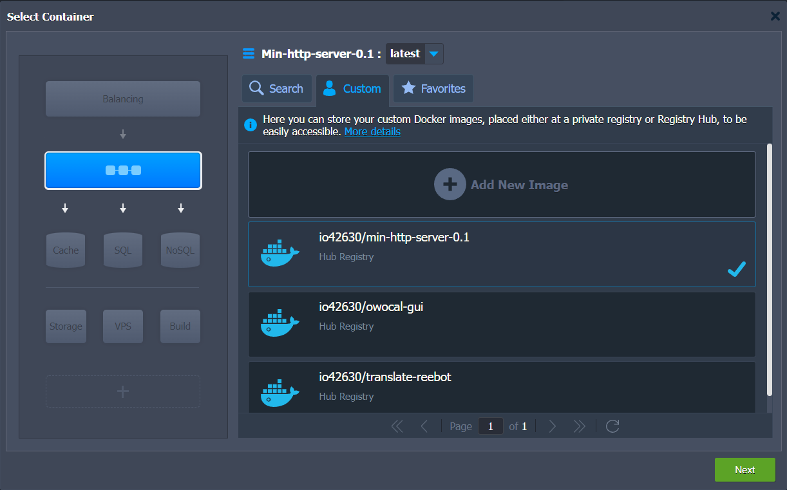
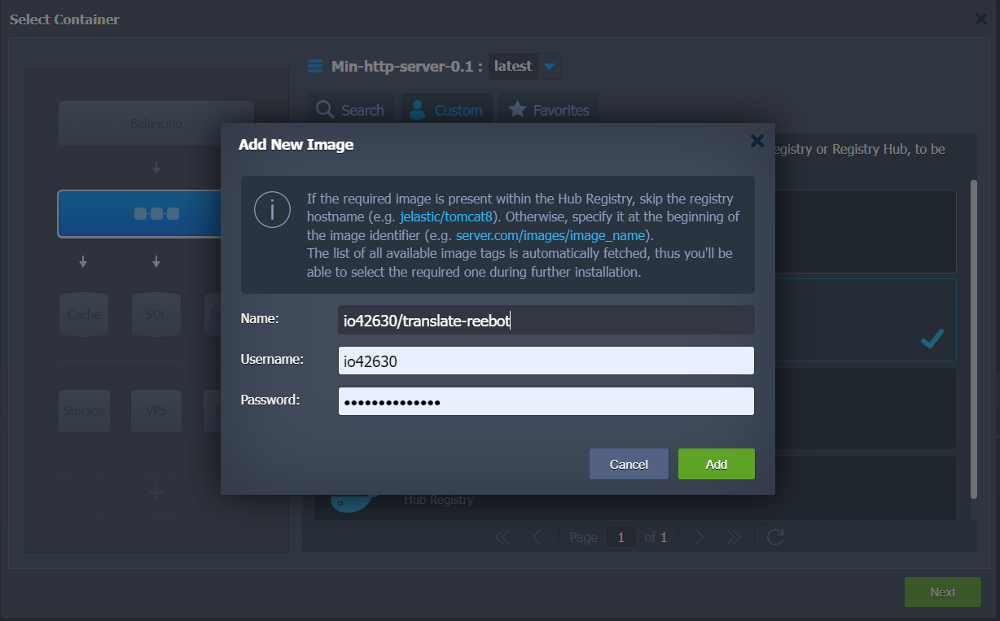

= 🐋 Docker
:toc:

=== General
==== Glossary
* 💿 Image (think OS image)
** `Dockerfile` : config for 💿
* 🚚 Container : running process
** `docker-compose` : `.yaml` config for 🚚

==== Misc
* 🐋 vs VM
** OS
*** 1 Layer : Kernel
*** 2 Layer : Application
** Docker -> virt the App (2)
** VM -> virt the OS (1+2)
* 🐋  has layers : OS, App, ...
** each layer can be downloaded separately & reused.

==== Ports
* specified in the 💿
* host/🚚 port mapping provided when launching 🚚

{empty} +

=== Jelastic Workflow

* create docker image
** `docker build -t <name>:<version> <dir of Dockerfile>`
* push to docker hub
* pull from engine
* in jelastic > docker engine > ssh
* `docker pull io42630/min-http-server-0.1`
* run
* `docker run -d -p 8090:8090 io42630/min-http-server-0.1`

//
//

{empty} +

=== `docker` Commands
* `ps` : print running containers.
** `-a` : show stopped containers.
* `start <id|name>` : start stopped container.
* `stop <id|name>` : stop container.
* `run <app>:<version>` : `pull` && `start`
** `-p<hostport>:<containerport>`
** `-d` : detached mode
** `--name <some-name>`
* `images` : print local 💿
* `rm <id>` : remove 🚚, required before removing 💿
* `rmi <id>` : remove  💿
* `pull <name>:<tag>`
** shorthand for `pull docker.io/library/<name>:<tag>`
*** `name` can be simple `mongo`
*** `name` can be `io42630/min-http-server-0.1`

* `push <repo-name>/<name>:<tag>` : default repo is _Docker Hub_
** example: `io42630/min-http-server:0.1`
* `logs <id|name>` : print log of container
* `exec -it <id|name> /bin/bash` : go to cli of container
** `exit` to leave cli

===== prune
* `image prune -a`

===== STOP
* `docker stop $(docker ps -a -q)` : stop all containers.

===== ACCESS
* `docker exec -it -u root $CONTAINER_NAME sh` : login for shell as root (bash is usually not available)

{empty} +

=== Network
* docker creates virtual networks
** 🚚 in those networks can talk directly
* docker network create <network-name>
* docker network ls : prints the auto-generated networks
** docker run -net <network-name>

* where we would use `localhost` in an app, we can use the service name e.g. `mongodb`,
and the docker network will take care of the rest.

* some containers may support envorimental vars
** `-e FOO=bar`

{empty} +

=== docker-compose
* translates `docker run` into a `.yaml`
* network is created automatically if 1+ 🚚 defined in same `.yaml`
* `docker-compose`
** `-f <yaml-file> up` : starts all 🚚 in `.yaml`
** `down` : stops 🚚 && removes networks
* options
** `--build --force-recreate`

{empty} +

=== Volumes
* mount dir of host into 🚚
* host-volume `docker run -v <host-dir>:<container-dir>`
* anon-volumes `docker run -v <container-dir>`
** links to host dir `/var/lib/docker/volumes/<hash>/_data
* named-volumes `docker run -v <name>:<container-dir>`
** links to host dir `/var/lib/docker/volumes/<name>/_data
* Volumes are not live file systems
** instead data is replicated on start stop

== Misc
* run docker daemon - dockerd
