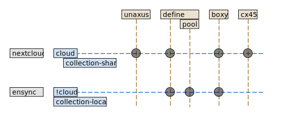

= Files

=== Levels of data:
1. *unaxus-cloud*
** for global access
** `www.olexyn.com/cloud`
** `local:/home/user/home/cloud/`
2. *home-shade*
** `local:/home/user/home/shade/`
3. *pool-shade*
** `localhost:9010/`
** `local:/media/pool/shade/`
4. *shade*
** backend storage / complete dataset
** `/media/pool/services/nextcloud/*/`

=== Contents of Data
1. unaxus-cloud
** wip
** tmp
** Files (for planning etc.)
2. *home-shade*
** all the common files
3. *pool-shade*
** some heavy files (movies, torrents)
4. *shade*
** full dataset

[source]
home
\__ app                           - 'expensive' files go here
                                  - do not sync
    \__ mail
        \__ xxx@xxx.com
    \__ mariadb
    \__ maven
\__ archive                       - 'expensive' un-used files go here
\__ cloud                         - all that can be synced
    \__ docs
        \__ career
    \__ collection-share
    \__ key
    \__ proj
\__ collection-local              - not sync
    \__ movies
\__ tmp                           - ignore
\__ ws                            - ignore, syc via git
