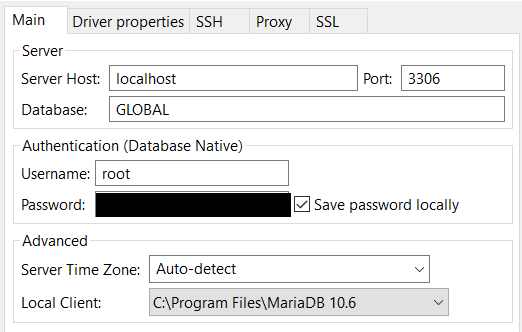

= Services
:toc:
:toclevels: 4

List of services running on `define`.

==== MariaDB
** `:3306`
** `C:\Users\user\home\app\mariadb\*`

[cols="1,4"]
|===
| users | `root:hostpwd` +
`dummy:this-is-pwd`
|===
